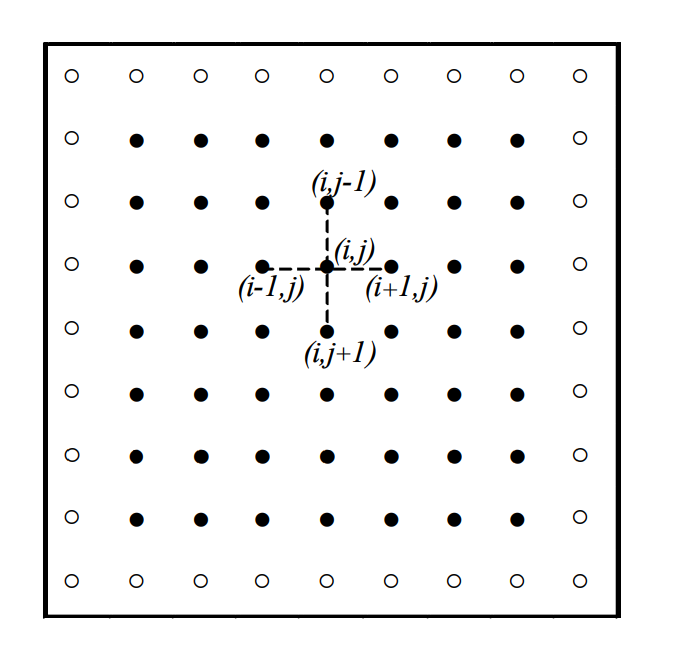
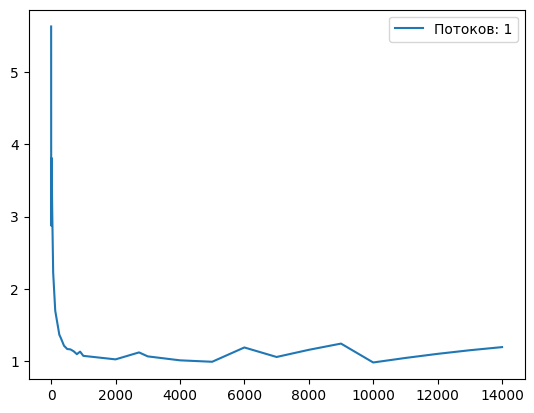
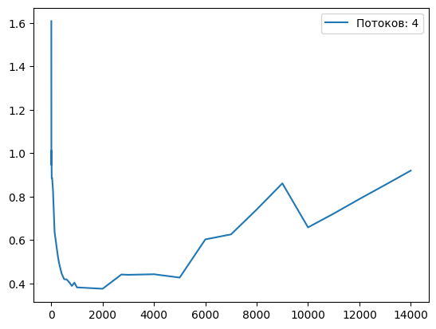
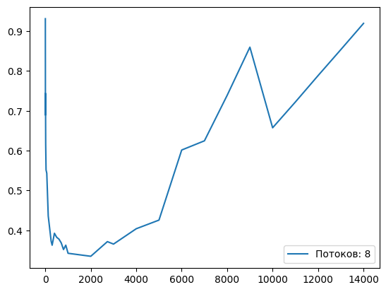
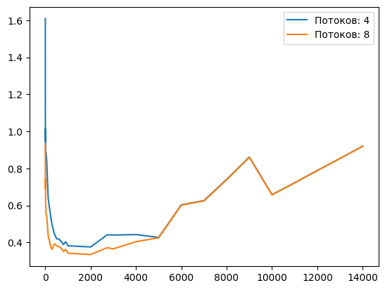

# Задача 1

## Цель эксперимента
Исследовать влияние размера блока на скорость выполнения алгоритма 11.6

## Условия эксперимента
Все вычисления выполнены на тестовом стенде с AMD Ryzen 7 5800u с 8 ядрами и 16 потоками HyperThreading и 16 ГБ оперативной памяти. В таблице ниже представлена информация о кэшах процессора.

| Cache Type |      Size        |
|------------|------------------|
| Cache L1   | 64 KB (per core) |
| Cache L2   | 512 KB (per core)|
| Cache L3   | 16 MB (shared)   |

В качестве операционной системы использовалась Ubuntu 22.04 в WSL (WSL version: 2.1.5.0; Kernel version: 5.15.146.1-2) и компилятор gcc версии 11.4.0.

Флаги компилятора и способ подсчета можно посмотреть в [experiment.ipynb](./experiment.ipynb).

Код запускался для получения аппроксимации функции $u(x, y) = 1000x^3 + 2000y^3$. 
Лапласиан которой равен $f(x, y) = 6000x + 12000y$.

Итерация алгоритма одна, размер сетки $20000$ на $20000$. Количество измерений в каждой точке $= 20$

Почему?

Выбор краевой задачи несущественен для подсчета изменения времени выполнения, так как функция для аппроксимации задает начальное состояние сетки и не влияет только на количество итераций.

Итерация алгоритма только одна, так как каждая итерация это полный обход сетки и подсчет значений по одной и той же формуле. А значит время выполнения между итерациями сопоставимо.

Размер сетки выбран так, чтобы можно было выбрать `BLOCK_SIZE` так, чтобы процессор не мог полностью поместить строки блока в L1 кеш. Но при этом хватило оперативной памяти для внутренних аллокаций.

## Представления об эффективном использовании кэша процессора

Процессоры, построенные на архитектуре AMD64, загружают в кеш последовательные данные (например, массивы в Си) из оперативной памяти по строкам кэша (cache line). Размер каждой строки равен 64 байтам. 

Наиболее эффективно используются выровненные массивы с размерами кратными размеру строки кэша, так как их можно полностью разделить на строки кэша "без остатка". Например, массив из 8 ячеек типа double (8 байт на ячейку) занимает ровно одну строку кэша.

В том числе наилучшие показатели использования кэша достигаются, если в кэше будет достаточно места для всех строк кэша обрабатываемого массива.

Для нашей задачи верно, что в L1 кеш процессора тестового стенда помещается не более $\frac{64 * 1024} {64} = 1024$ строк кэша. А значит не больше, чем 8192 ячеек типа double.

Заметим, что для эффективной работы алгоритма и подсчета значения в единственной ячейке $(i, j)$ требуется загрука минимум трех строк в кеш процессора. Включающие ячейки $(i - 1 , j)$, $(i , j - 1)$, $(i, j + 1)$.

А значит максимальный `BLOCK_SIZE` эффективно использующий L1 кэш равен $2730$ 

Узлы сетки, которые участвуют в вычислении

Таким образом ожидается, что:
1. при `BLOCK_SIZE` $\in [1, 7]$ время выполнение будет наибольшим.
2. затем время выполнения одной итерации алгоритма "стабилизируется" и не будет существенно изменяться относительно `BLOCK_SIZE`
3. а начиная с `BLOCK_SIZE` $= 2730$ время выполнения будет постепенно увеличиваться

## Результаты

Результаты эксперимента можно увидеть в [experiment.ipynb](./experiment.ipynb). Для создания интерактивного графика запустите[visualize.py](./visualize.py).

Кроме того, в [experiment.txt](./experiment.txt) представлена информация о количестве блоков, используемом `BLOCK_SIZE` и количестве блоков на один поток.

В per_thread.npy хранятся результаты в виде numpy массива, вида:

(индекс количества потоков`*`) к (нижняя граница доверительного интервала по каждому `BLOCK_SIZE`, среднее по каждому `BLOCK_SIZE`, вверхняя граница доверительного интервала по каждому `BLOCK_SIZE`)

`*` Индекс 0 - 1 поток, 1 - 4 потока, 2 - 8 потоков.

Полный график для 1, 4 и 8 потоков

## Результат

### Всплеск при малых `BLOCK_SIZE`
На всех графиках наблюдается всплеск при небольших размерах `BLOCK_SIZE`. Это вызвано тем, что потоку приходится "прыгать" между блоками по диагонали (из-за особенности реализации метода волновой обработки), что приводит к частому обращению к оперативной памяти, так из кэш линии берется 1 ячейка double из 8, а затем загружается новая линия кэша.

### Отсутствие замедления при изменении `BLOCK_SIZE` однопоточной программы 
Предположение о зависимости `BLOCK_SIZE` больших размеров и кэш-промахов не подтвердилось, так как однопоточный алгоритм, начиная с момента  `BLOCK_SIZE` = 1000, даже при размерах блока предположительно невмещающихся в L1 кэш, продолжил работать за время близкое к одной секунде. Хотя предполагалось, что начиная с `BLOCK_SIZE` $= 2730$ время выполнения будет постепенно увеличиваться.

### Замедление до 2 раз при изменении `BLOCK_SIZE` многопоточной версии 

Однако, многопоточные версии, а особенно с 8 потоками, при увеличении `BLOCK_SIZE` стали медленнее в 2 раза относительно минимума. Время выполнения одной итерации алгоритма с 8 потоками росло начиная с `BLOCK_SIZE` $= 2730$, а с 4 начиная с $5000$.

### "Склейка" времени выполнения начиная с количества блоков на один поток равного единицы
Сравнение количества блоков на один поток в [experiment.txt](./experiment.txt) и результатов на графиках дает объяснение, почему так происходит.

Как только количество блоков на поток становится меньше единицы количество потоков обрабатывающих сетку уменьшает соответсвенно. Так, если количество блоков на поток становится равно 0.5 для алгоритма запущенного на 8 потоках, то реальнон количество потоков вычисляющих результат равно 4.

Это объясняет, почему при `BLOCK_SIZE` $= 5000$ 8 поточное и 4 поточное приложение работают с одинаковой скоростью

## Выводы

На скорость выполнения алгоритма влияет не утилизация кэша, а отношение количество блоков / количество потоков и размер блока. Худшие результаты достигаются, когда это отношение < 1 или размер блока меньше 8.

Наилучшие результаты достигаются, если отношение $\in [2; 5]$.
