# Задача 3

    Реализация сжатия изображений с использованием SVD: https://github.com/toadharvard/svdi-cli

    Способ генерации и параметры описаны в скрипте ./run.sh

## Эксперимент

Рассматриваемые алгоритмы:
1. Степенной метод (power iterations)[1]
2. pcafast[2]
3. rsvd[3]
4. SVD из numpy

[1] http://www.cs.yale.edu/homes/el327/datamining2013aFiles/07_singular_value_decomposition.pdf

[2] H. Li, G. C. Linderman, A. Szlam, K. P. Stanton, Y. Kluger, and M. Tygert. Algorithm 971: An implementation of a randomized algorithm for principal component analysis. Acm Transactions on Mathematical Software, 43(3):1-14, 2017.

[3] N. Halko, P. G. Martinsson, and J. A. Tropp. Finding structure with randomness: Probabilistic algorithms for constructing approximate matrix decompositions. Siam Review, 53(2):217-288, 2011.

### Данные

Алгоритмы рассмотрены на изображениях с квадратами, кругами и на изображении Снайперской Винтовкой Драгунова.

Все изображения

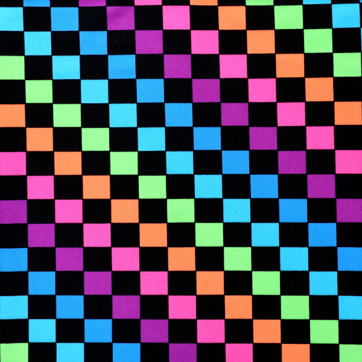
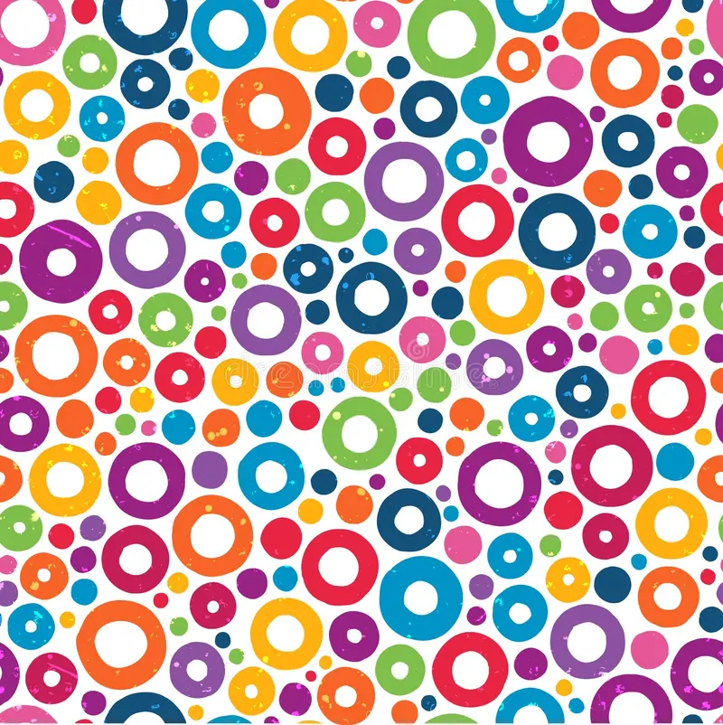
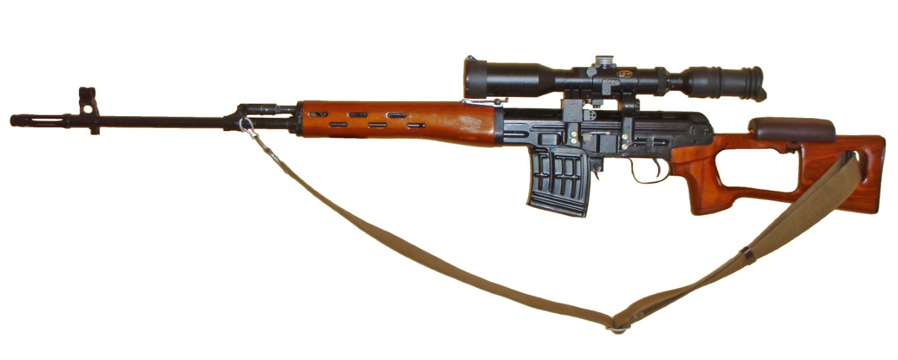

### Круги

| Algorithm | Compressed x1 |
| --- | --- |
| power iterations | 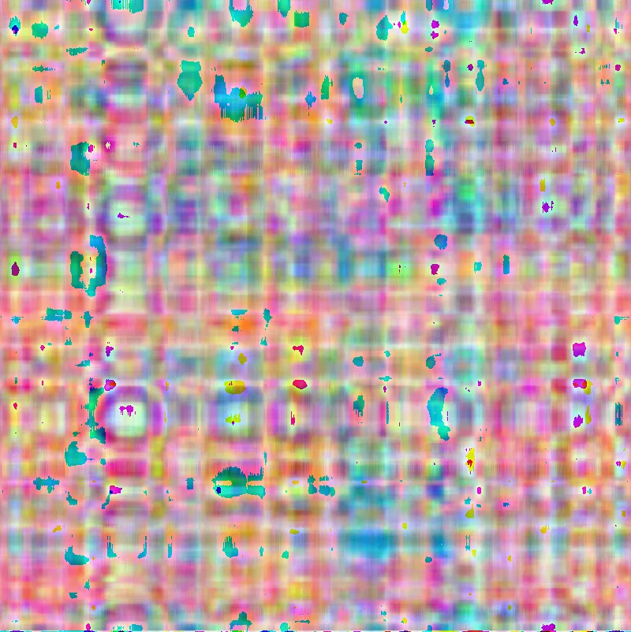 |
| pcafast | 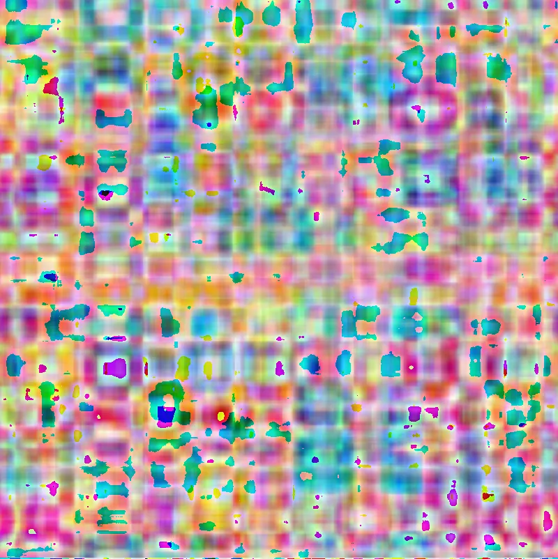 |
| rsvd |  |
| numpy |  |

| Algorithm | Compressed x3 |
| --- | --- |
| power iterations | 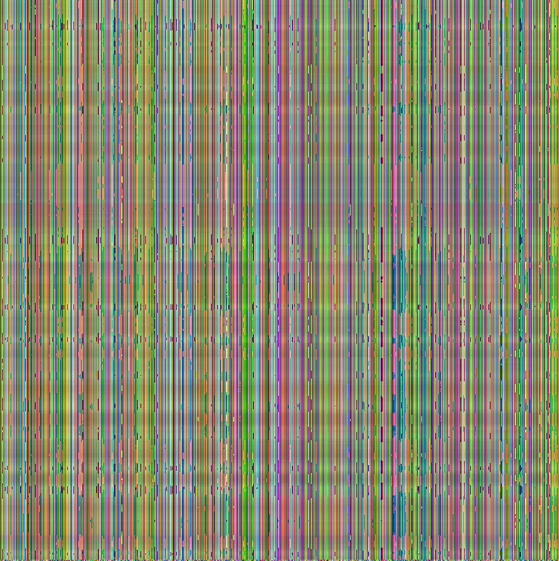 |
| pcafast | 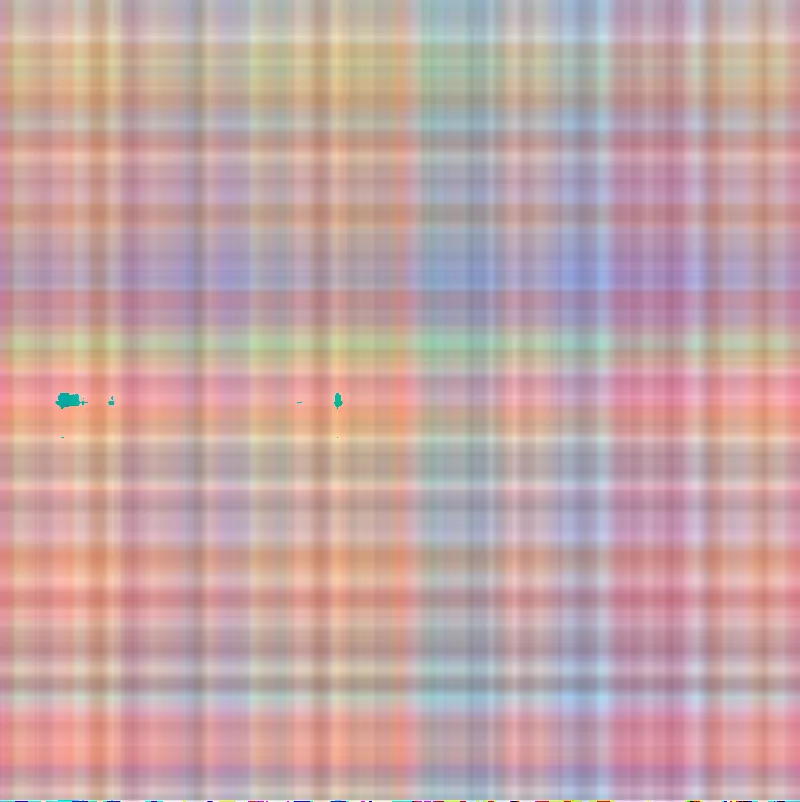 |
| rsvd |  |
| numpy |  |

При сжатии в 3 раза различить круги на изображениях становится невозможным.

Изображение сжатое с power iterations превратилось в вертикальные линии.

### SVD

| Algorithm | Compressed x1 |
| --- | --- |
| power iterations | 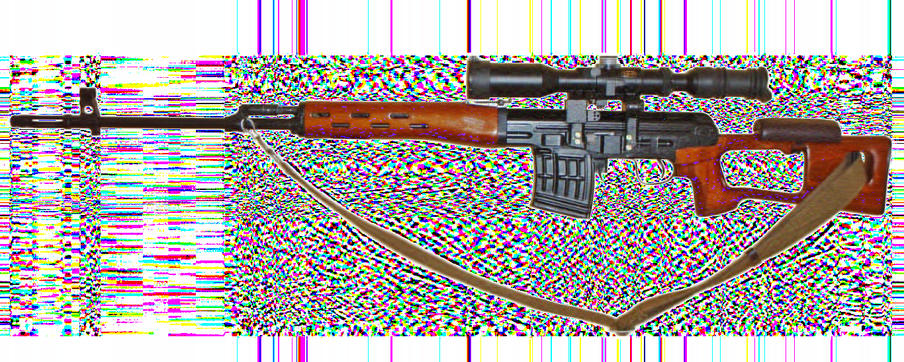 |
| pcafast | 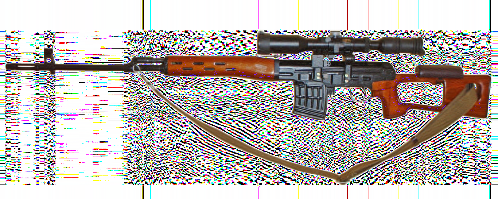 |
| rsvd |  |
| numpy | 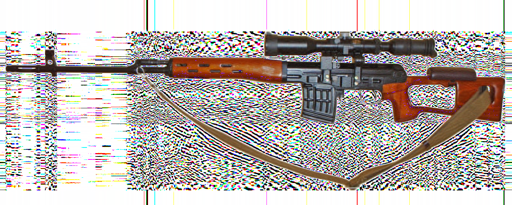 |

| Algorithm | Compressed x3 |
| --- | --- |
| power iterations | 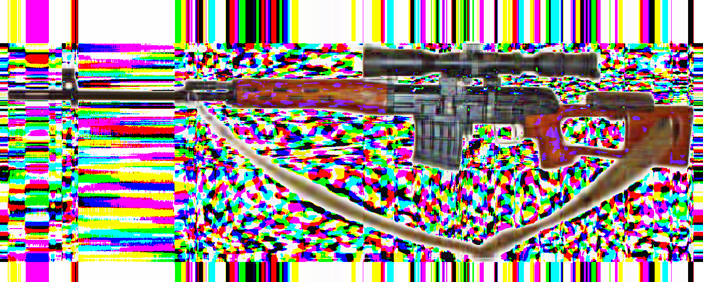 |
| pcafast | 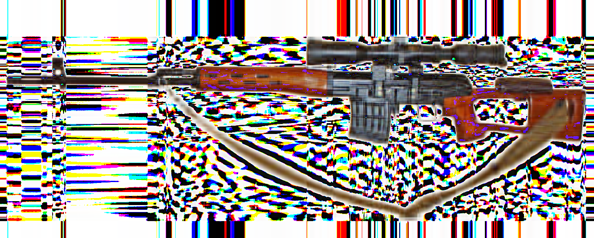 |
| rsvd | 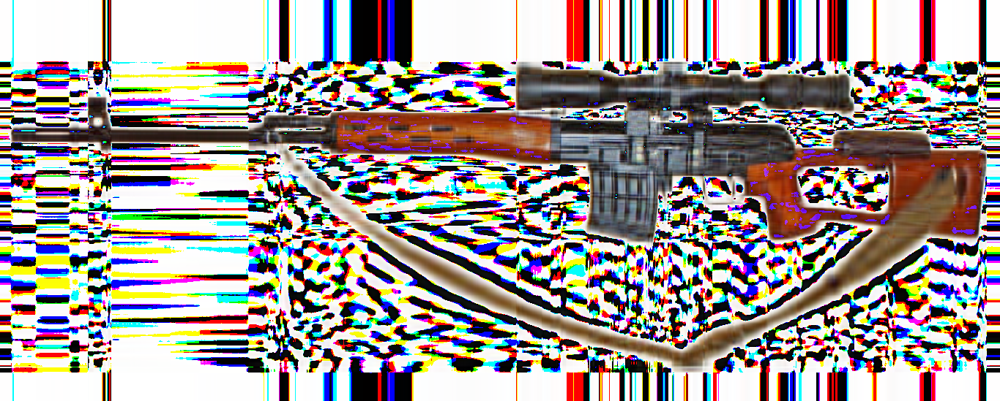 |
| numpy | 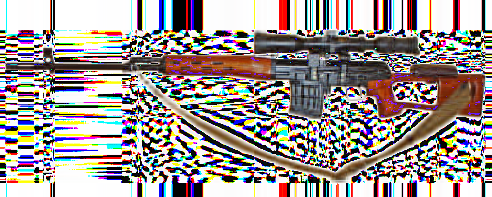 |

| Algorithm | Compressed x10 |
| --- | --- |
| power iterations | 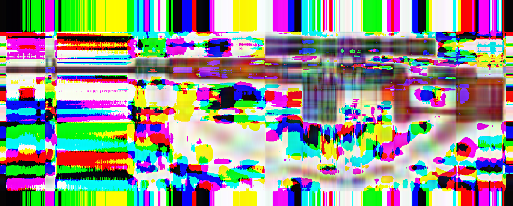 |
| pcafast |  |
| rsvd | 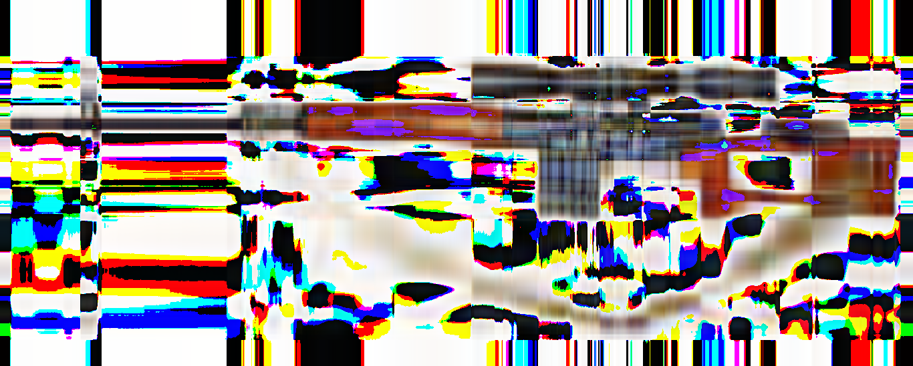 |
| numpy |  |

| Algorithm | Compressed x30 |
| --- | --- |
| power iterations | 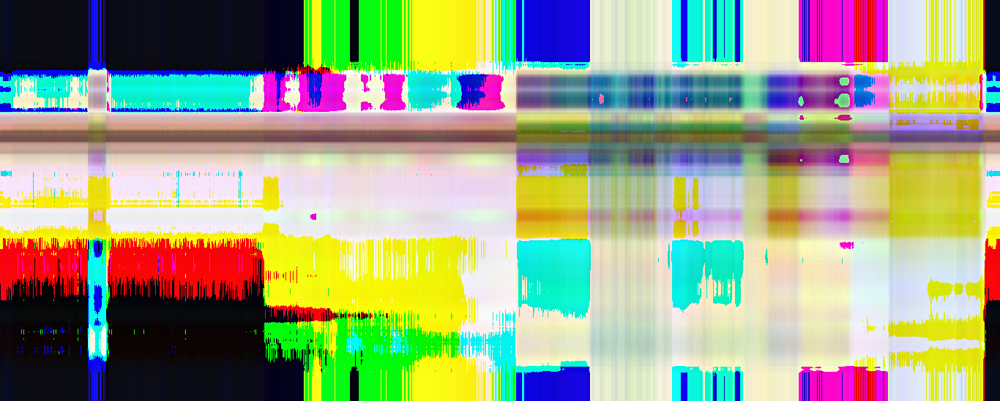 |
| pcafast | 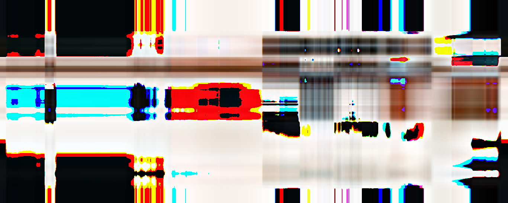 |
| rsvd |  |
| numpy |  |

Сжатие с помощью power iterations оказалось в ~2 раза медленеее. 

Полностью белая часть изображения превратилась в месиво из цветов.

Продвинутые алгоритмы выдали схожие результаты. 

Power iterations оказался значительно хуже, даже при сжатии 1. А при большем артефакты только усилились.

### Квадраты

| Algorithm | Compressed x1 |
| --- | --- |
| power iterations | 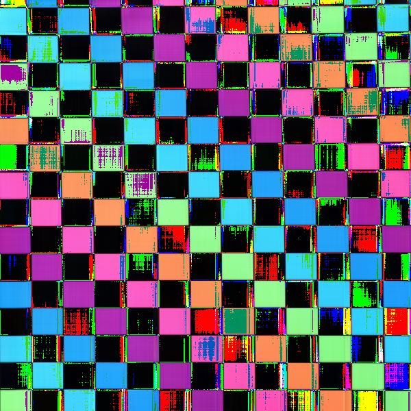 |
| pcafast |  |
| rsvd | 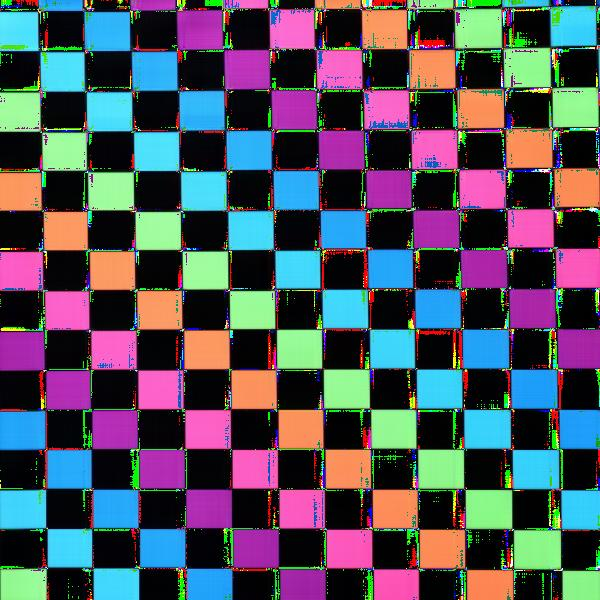 |
| numpy |  |

| Algorithm | Compressed x3 |
| --- | --- |
| power iterations | 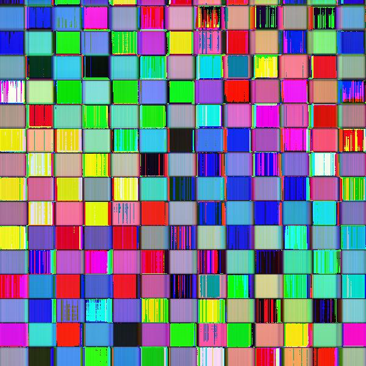 |
| pcafast | 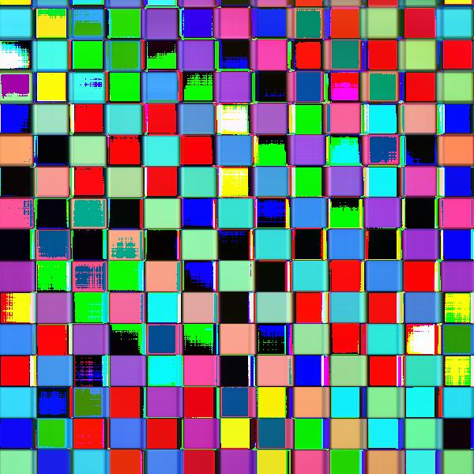 |
| rsvd |  |
| numpy |  |

Хотя итоговые цвета после сжатия с помощью power iterations отличаются от других, на изображении можно четко выделить квадраты.

## Выводы

1. Эффективнее всего сжимаются квадраты. Хуже всего круги и прочие фигуры с множеством изгибов.

2. Power iterations ожидаемо хуже ищет сингулярные числа, а так же медленнее других.

3. Одноцветные участки изображения становятся цвета "профилактики на телевидении"
